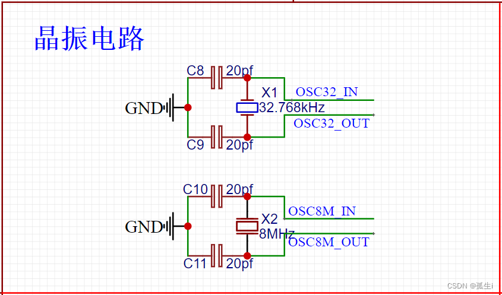

## 1.STM32硬件电路设计

### 1.1最小系统设计

#### 1.1.1 复位电路


#### 1.1.2 晶振电路

- 负载电容无法满足的话一般会使晶体频率产生偏差，严重的话晶体无法起振。负载电容的值由如下公式计算：CL=C1*C2/(C1+C2)+CS，CL为晶振的负载电容值，一般通过查询晶振的数据手册获得。CS为电路板的寄生电容，一般取3-5pf。取C1=C2，公式可简化成：CL=C1/2+CS。一般情况下，增大负载电容值，会使震荡频率下降；减小负载电容值，会使振荡频率上升
- 画板时晶振尽量离芯片近一点
- 晶振底部尽量不要穿过其他支路，防止信号串扰
- 不同型号的晶振可能需要不同的电路设计，根据自己使用的晶振型号设计，例如使用村田的CSTCE系列晶振，可以设计成如下电路：
- 

#### 1.1.3 电源电路

USB为5V

STM32芯片的工作电压为2.0~3.6V，我们一般取**3.3V**

- **输入滤波电容的作用**：

输入电压，当接入电源，其幅值是从零起始的，波动非常大，加入足够容量的电容进行滤波后，因电容的充放电效应，该脉动直流变成纹波不大的直流电，这是输入滤波的作用。

- **输出滤波电容的作用**：

稳压电路的工作过程需要从输出采样，然后根据其反馈值调节输出以达稳压的目的。如果此时没有输出滤波电容，只要因负载变化带来的电压波动频率恰好与稳压电路的调节速率差不多就会产生振荡效应，导致输出失控，所以稳压输出也必须加滤波电容，而且增加滤波电容也可以进一步增加稳压输出的稳定性。

- **大电容和小电容并联的作用**

至于与大容量电解电容并联的小电容，其作用在于旁路频率较高的波动电压，因为铝电解电容的制造工艺导致其具有较大的ESL（等效电感），无法滤除高频成份，故需加个小电容。


#### 1.1.4 SWD下载电路

（PA13和PA14为STM32F103C8T6芯片的SWD下载调试引脚），直接相连外接口


## 2.  关于RCC时钟

STM32时钟系统主要的目的就是给相对独立的外设模块提供时钟，也是为了降低整个芯片的耗能。

系统时钟，是处理器运行时间基准（每一条机器指令一个时钟周期）

时钟是单片机运行的基础，时钟信号推动单片机内各个部分执行相应的指令。

一个单片机内提供多个不同的系统时钟，可以适应更多的应用场合。

不同的功能模块会有不同的时钟上限，因此提供不同的时钟，也能在一个单片机内放置更多的功能模块。

对不同模块的时钟增加开启和关闭功能，可以降低单片机的功耗

STM32为了低功耗，他将所有的外设时钟都设置为disable(不使能)，用到什么外设，只要打开对应外设的时钟就可以， 其他的没用到的可以还是disable(不使能)，这样耗能就会减少。 这就是为什么不管你配置什么功能都需要先打开对应的时钟的原因。

### 1.1 系统时钟SYSCLK

系统时钟SYSCLK**可来源于三个时钟源：**

①  、HSI振荡器时钟②、HSE振荡器时钟③、PLL时钟


### 1.2. 系统时钟通过AHB分频器给外设提供时钟(右边的部分) 重点

从左到右可以简单理解为 系统时钟--->AHB分频器--->各个外设分频倍频器 --->  外设时钟的设置

右边部分为：系统时钟SYSCLK通过AHB分频器分频后送给各模块使用，AHB分频器可选择1、2、4、8、16、64、128、256、512分频。其中AHB分频器输出的时钟送给5大模块使用： 

　①内核总线：送给AHB总线、内核、内存和DMA使用的HCLK时钟。 

　②Tick定时器：通过8分频后送给Cortex的系统定时器时钟。 

　③I2S总线：直接送给Cortex的空闲运行时钟FCLK。 

　④APB1外设：送给APB1分频器。APB1分频器可选择1、2、4、8、16分频，其输出一路供APB1外设使用(PCLK1，最大频率36MHz)，另一路送给通用定时器使用。该倍频器可选择1或者2倍频，时钟输出供定时器2-7使用。 

　⑤APB2外设：送给APB2分频器。APB2分频器可选择1、2、4、8、16分频，其输出一路供APB2外设使用(PCLK2，最大频率72MHz)，另一路送给高级定时器。该倍频器可选择1或者2倍频，时钟输出供定时器1和定时器8使用。

另外，APB2分频器还有一路输出供ADC分频器使用，分频后送给ADC模块使用。ADC分频器可选择为2、4、6、8分频。 

需要注意的是，如果 APB 预分频器分频系数是 1，则定时器时钟频率 (TIMxCLK) 为 PCLKx。否则，定时器时钟频率将为 APB 域的频率的两倍：TIMxCLK = 2xPCLKx。 

**F1****系列：APB1****上面连接的是低速外设，包括电源接口、备份接口、CAN****、USB****、I2C1****、I2C2****、USART2****、USART3****、UART4****、UART5****、SPI2****、SP3****等；**

**而APB2****上面连接的是高速外设，包括UART1****、SPI1****、Timer1****、ADC1****、ADC2****、ADC3****、所有的普通I/O****口（PA-PE****）、第二功能I/O****（AFIO****）口等。**

**不同系列的MCU****上面的外设连接会有所区别**

**通过 STM32****参考手册搜索“****系统架构”****或者“****系统结构”** **查看外设挂在哪个时钟下**

①  在HAL库中，中断运行结束后不会立刻退出，而是会先进入相对应的中断回调函数，处理该函数中的代码之后，才会退出中断，**所以在****HAL****库中我们一般将中断需要处理代码放在中断回调函数中

**void HAL_GPIO_EXTI_Callback(uint16_t GPIO_Pin);**

``` c
/**
  * 函数功能: 按键外部中断回调函数
  * 输入参数: GPIO_Pin：中断引脚
  * 返 回 值: 无
  * 说    明: 无
  */
void HAL_GPIO_EXTI_Callback(uint16_t GPIO_Pin)
{
  if(GPIO_Pin==KEY1_GPIO_PIN)
  {
  
    if(HAL_GPIO_ReadPin(KEY1_GPIO,KEY1_GPIO_PIN)==KEY1_DOWN_LEVEL)
    {
      BEEP_TOGGLE;
      LED1_ON;
      LED2_ON;
      LED3_ON;
    }
    __HAL_GPIO_EXTI_CLEAR_IT(KEY1_GPIO_PIN);
  }
  else if(GPIO_Pin==KEY2_GPIO_PIN)
  {
 
    if(HAL_GPIO_ReadPin(KEY2_GPIO,KEY2_GPIO_PIN)==KEY2_DOWN_LEVEL)
    {
      BEEP_TOGGLE;
      LED1_OFF;
      LED2_OFF;
      LED3_OFF;
    }
    __HAL_GPIO_EXTI_CLEAR_IT(KEY2_GPIO_PIN);
  }
}
```

**②**  GPIO输出模式[(35条消息) 【STM32】STM32F4 GPIO八种模式及工作原理详解_stm32 ft引脚_Z小旋的博客-CSDN博客](https://blog.csdn.net/as480133937/article/details/98063549)

## 3. 配置

### 3.1 SysTick

```c
(1)
SysTick_Config(SystemCoreClock / 100000)) //SystemCoreClock系统主频
   									 //---在stm32h7xx_hal.c文件的HAL_InitTick(uint32_t TickPriority);
   			                           // SystemCoreClock / 1000 表示定时频率为 1000Hz， 也就是定时周期为 1ms。
(2)
在中断处理函数中，处理 void SysTick_Handler(void); // ----在stm32h7xx_it.c文件中
```

### 3.2 MPU配置

```c
/* *********************************************************************************************************
* 函 数 名: MPU_Config 
* 功能说明: 配置 MPU, 二选一
* 形 参: 无 
* 返 回 值: 无 ********************************************************************************************************* */ 
static void MPU_Config( void )
{ 
    MPU_Region_InitTypeDef MPU_InitStruct; /* 禁止 MPU */ 
    HAL_MPU_Disable();
    
    /* 配置 AXI SRAM 的 MPU 属性为 Write back, Read allocate，Write allocate */ 
    MPU_InitStruct.Enable = MPU_REGION_ENABLE; 
    MPU_InitStruct.BaseAddress = 0x24000000; 
    MPU_InitStruct.Size = MPU_REGION_SIZE_512KB;
    MPU_InitStruct.AccessPermission = MPU_REGION_FULL_ACCESS; 
    MPU_InitStruct.IsBufferable = MPU_ACCESS_BUFFERABLE; 
    MPU_InitStruct.IsCacheable = MPU_ACCESS_CACHEABLE; 
    MPU_InitStruct.IsShareable = MPU_ACCESS_NOT_SHAREABLE; 
    MPU_InitStruct.Number = MPU_REGION_NUMBER0; 
    MPU_InitStruct.TypeExtField = MPU_TEX_LEVEL1; 
    MPU_InitStruct.SubRegionDisable = 0x00; 
    MPU_InitStruct.DisableExec = MPU_INSTRUCTION_ACCESS_ENABLE;
    HAL_MPU_ConfigRegion(&MPU_InitStruct); 
    
    /* 配置 FMC 扩展 IO 的 MPU 属性为 Device 或者 Strongly Ordered */ 
    MPU_InitStruct.Enable = MPU_REGION_ENABLE;
    MPU_InitStruct.BaseAddress = 0x60000000; 
    MPU_InitStruct.Size = ARM_MPU_REGION_SIZE_64KB; 
    MPU_InitStruct.AccessPermission = MPU_REGION_FULL_ACCESS; 
    MPU_InitStruct.IsBufferable = MPU_ACCESS_BUFFERABLE;
    MPU_InitStruct.IsCacheable = MPU_ACCESS_NOT_CACHEABLE; 
    MPU_InitStruct.IsShareable = MPU_ACCESS_NOT_SHAREABLE;
    MPU_InitStruct.Number = MPU_REGION_NUMBER1; 
    MPU_InitStruct.TypeExtField = MPU_TEX_LEVEL0;
    MPU_InitStruct.SubRegionDisable = 0x00; 
    MPU_InitStruct.DisableExec = MPU_INSTRUCTION_ACCESS_ENABLE; 
    HAL_MPU_ConfigRegion(&MPU_InitStruct); 
    
    /*使能 MPU */ 
    HAL_MPU_Enable(MPU_PRIVILEGED_DEFAULT); 
}
```

